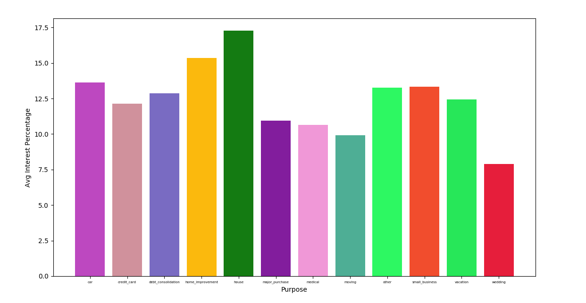
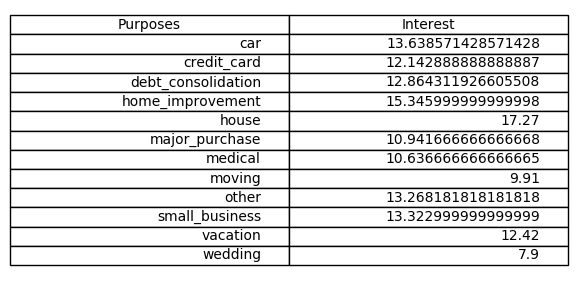

# MAIS 202 - Application Coding Challenge

Loans are an extremely powerful financial instrument; they have the potential to create opportunities and foster growth. To learn more about loans and what influence them, we have provided you with a csv file called *data.csv* that contains information about loans such as their interest rate, purpose, length, grade, and amount in a comma seperated format as shown below.


## Instructions

Your challenge will be as follows:

1. Make a copy of this repository on your own personal github account (you can fork or download it). 

2. Write a python script which loads the dataset, parses the information, and uses it to calculate the average interest rates for each of the listed purposes. 

3. Plot the results onto a graph.

## Sample Results

The output of your script should be similar to the results shown below. 

<div style="display=block;">


</div>

# Instructions
Simple script written using Python 3.5 to parse through a csv and calculate the average interest rate of a loan based on loan purpose.

## (Optional) Setup Virtual Env
```
virtualenv -p python3 <name of virtual environment>
source <name of virtual environment>/bin/activate
```

## Install packages
* Numpy
* Matplotlib
* Pandas
```
pip install -r requirements.txt
```

## Run script
With data.csv in the same directory, run the following command
```
python interest_avg.py
```

## Output





